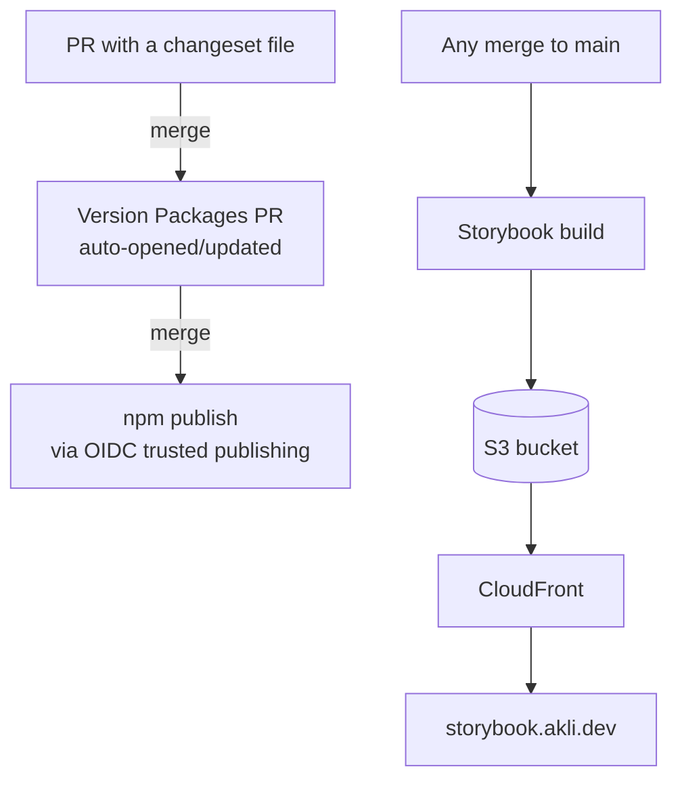

<Image src="/images/blog/storybook-button-docs.webp" alt="Storybook's sidebar listing every component, with the Button component's docs page open showing its props table and a live example" caption="The component library, browsable at storybook.akli.dev" priority />

`@akli-dev/ui` is a small React component library: `Header`, `Footer`, `Button`, `Typography`, `Input`, `Card`, a handful more, plus the design tokens and self-hosted fonts behind them. It lives in its own repo, publishes to npm as `@akli-dev/ui`, and ships a public Storybook at [storybook.akli.dev](https://storybook.akli.dev). The main site, the one you're reading this on, now depends on it like any other package. It didn't used to. Every one of these components used to live directly inside this site's own codebase, and pulling them out turned into a longer project than I expected, mostly because of the parts that don't show up when you're just looking at the components themselves.

## Copy-paste doesn't scale past one redesign

The immediate trigger wasn't this site at all. I'd already built a Pokedex app at `pokedex.akli.dev` and a small sandbox game at `sandbox.akli.dev`, both living on akli.dev alongside it, and neither one shares so much as a `Header` component with the other today. If I want all three to eventually read as one site, rather than three unrelated projects glued together by a shared domain, they need the same header, footer, fonts, and colour tokens. Without a shared package, the only way to get that is to copy the components across, by hand, into each app.

Copy-paste like that survives exactly until the design changes. It went through a full "paper" redesign not long before this: new radius scale, new tokens, new component styling, applied one component at a time across dozens of issues. If Header and Footer had already been duplicated into two other apps at that point, every one of those changes would have needed doing three times, and the three copies would have started drifting the moment anyone forgot the third one. That's the actual argument for extracting a shared package. Not "components are reusable" as an abstract virtue, but a specific redesign I'd just lived through, which would have been three redesigns instead of one if I'd waited any longer.

So `@akli-dev/ui` exists to be the one place the header, footer, buttons, and tokens live, versioned, with every app depending on a release instead of a copy. This site's own migration onto the package went through four phases, tokens and fonts first, then leaf components, then interactive ones, then Header/Footer/ThemeToggle last since they sit on every single page. By the end there were no local duplicates left in its codebase at all; everything generic comes from the package now.

## A README can't render a component

Once the components live in a package with no host app wrapped around them, you need somewhere to actually look at them. That's what Storybook is for, but it's doing three different jobs, not one.

The obvious one is development. `Header` alone has three real variants (`public`, `admin`, `logged-out`), and I want to see all three, in both light and dark theme, without spinning up the main site and logging in and out to trigger each state. Storybook gives every component its own story per variant, and a toolbar toggle flips the theme across all of them at once. The docs side of this matters too: Storybook's autodocs addon generates a props table straight from each component's TSDoc comments, so the documentation is the component's own type signature, not a hand-maintained README that quietly goes stale the first time a prop gets renamed.

<Image src="/images/blog/storybook-header-public-variant.webp" alt="The Header component's public variant, rendered in Storybook" caption="Header's public variant, viewed in Storybook" />

The second job is public. Storybook is deployed openly at `storybook.akli.dev`, its own S3 bucket and CloudFront distribution in `akli-infrastructure`, the same pattern as the Pokedex and sandbox subdomains. Anyone can browse it. That makes it a portfolio artefact in its own right, a design system someone can click through without needing to know anything about the main site specifically.

The third job is the one I didn't expect to matter as much as it does: an accessibility gate that actually runs. `addon-a11y` runs real axe-core checks against each story in a real browser, and a real browser is the point. My existing `vitest-axe` component tests run in jsdom, which can catch missing labels and bad ARIA, but jsdom has no layout engine, so it can't tell you whether text actually has enough contrast against its background or whether a focus ring is visible. Storybook renders in an actual browser, so its accessibility checks cover ground jsdom structurally cannot. This isn't just eyeballing the Storybook UI by hand either; `@storybook/test-runner` runs the same checks headlessly in CI, so an accessibility regression fails a build the same way a broken test would.

<Callout type="tip">Autodocs generated from TSDoc comments can't drift out of sync with the component, because there's only one source of truth: the code. A hand-written README always eventually lies.</Callout>

## The font ordering contract nobody can see by reading the CSS

akli.dev self-hosts Geist and JetBrains Mono, and getting that right without a layout shift on load turned out to be more than adding `font-display: swap`. The actual anti-shift trick is a metric-matched fallback face, `'Geist Fallback'`, computed with capsize so its `ascent-override`, `descent-override`, and `size-adjust` values match Geist Regular's box model closely enough that swapping the real font in doesn't reflow the page.

That fallback face is declared in `fonts.css`. It's then referenced by name inside `tokens.css`'s `--font-sans` stack:

```css title="tokens.css"
--font-sans: 'Geist', 'Geist Fallback', system-ui, sans-serif;
```

The catch is that `'Geist Fallback'` has to exist by the time `--font-sans` is evaluated, which means `fonts.css` has to be imported before `tokens.css`. Get the order backwards and nothing throws an error. The page still renders, the font still loads, and the only symptom is a layout shift you'd only notice if you were already looking for it. Two files, no import connecting them, and one has to load before the other or a mechanism silently stops working. That's not something a future consumer of the package can work out by reading either file on its own, so it's documented explicitly as an ordering contract in the package README rather than left as tribal knowledge.

Font preloading has a similar hidden dependency, just on the build tooling instead of CSS. When the font lived inside this site's own codebase directly, a `<link rel="preload">` in its own `index.html` worked fine, because Vite owns that file and rewrites the source path to the final hashed build filename automatically. Once the font moves into `node_modules/@akli-dev/ui`, that link would have to point at a hash the consuming app's own build generates, and that hash changes on every build. A hardcoded preload tag would go stale the first time anyone rebuilt.

The fix is a small Vite plugin the package ships as a separate export:

```typescript title="src/vite-plugin.ts"
export const preloadFonts = (): Plugin => {
  let fontFileName: string | undefined

  return {
    name: '@akli-dev/ui:preload-fonts',
    generateBundle(_options, bundle) {
      for (const asset of Object.values(bundle)) {
        if (asset.type === 'asset' && /geist-sans/i.test(asset.fileName)) {
          fontFileName = asset.fileName
        }
      }
    },
    transformIndexHtml() {
      if (!fontFileName) return
      return [{
        tag: 'link',
        attrs: { rel: 'preload', as: 'font', type: 'font/woff2', href: `/${fontFileName}`, crossorigin: true },
        injectTo: 'head-prepend',
      }]
    },
  }
}
```

`generateBundle` runs after Rollup has decided the final hashed filename, so the plugin reads the real name out of the bundle instead of guessing it, then `transformIndexHtml` injects a correctly pointed preload link into the consumer's own `index.html`. A consumer wires it into their own `vite.config.ts` once, and it stays correct across rebuilds because it's asking the bundler rather than hardcoding an answer.

That only works if the font shows up in the bundle as a real file with a real URL, and getting there took a wrong turn first. My first pass set `build.assetsInlineLimit` to explicitly exclude `.woff2`, on the reasonable assumption that Vite's usual base64-inlining threshold was the thing standing between the font and a preloadable URL. It built fine and did nothing, because `assetsInlineLimit` is dead code under [Vite 8's library mode](https://vite.dev/guide/build#library-mode). Reading Vite's own source confirmed it: when `build.lib` is set, asset inlining is always forced on before `assetsInlineLimit` is even consulted, on the assumption that a library's output should be self-contained. The fix turned out to be a `?no-inline` query suffix on the asset reference itself, added directly to each `url(...)` in `fonts.css`:

```css title="src/styles/fonts.css"
src: url('../assets/fonts/geist-sans-latin-variable.woff2?no-inline') format('woff2');
```

That one query string was the difference between "font ships as a real file `preloadFonts()` can point at" and "font vanishes into the CSS as base64 with nothing for the plugin to find." Not something I'd have guessed without going and reading how Vite actually resolves inlining in library mode.

## CSS packaging, twice

The first version of the package, v1.0.0, compiled every component's CSS into one file, `dist/index.css`. Simple to build, simple to import once. It also meant `import { Button } from '@akli-dev/ui'` shipped Button's styles and every other component's styles in the same file, whether or not anything else was actually rendered.

JS was fine. Tree-shaking already worked there, and a bundle-size CI gate confirmed unused component code got dropped. CSS had no equivalent, and the cost wasn't hypothetical. akli.dev's own `Card` component only renders on the admin login route, which is lazy-loaded specifically so its code doesn't weigh down every other page. Under v1's packaging, adopting `Card` from the shared package would have meant Card's CSS living in one eagerly-loaded global file, loaded on every page regardless of route, undoing exactly the code-splitting that already existed before extraction.

v2.0.0, a deliberate breaking change shipped through Changesets, fixed this with `preserveModules` on the Rollup output plus `vite-plugin-lib-inject-css`:

```typescript title="vite.config.ts"
export default defineConfig({
  build: {
    lib: { entry: 'src/index.ts', formats: ['es'] },
    cssCodeSplit: true,
    rollupOptions: {
      output: { preserveModules: true, preserveModulesRoot: 'src' },
    },
  },
  plugins: [libInjectCss(), dts()],
})
```

Each component's compiled JS now carries its own import of only its own CSS, so a consumer's bundler tree-shakes unused component styles the same way it already tree-shook unused component code. I considered the other obvious fix, shipping one CSS file per component that consumers import by hand, the way early [Ant Design](https://ant.design) did it, and rejected it. That pattern reintroduces the classic trap where you forget the CSS import and get an unstyled component with no error telling you why.

One subtlety cost real debugging time. A few components share styles across files using CSS Modules' `composes:`:

```css title="Button.module.css"
.button {
  composes: focusRing from '../../styles/interactions.module.css';
}
```

Under `preserveModules`, a `composes:` reference doesn't get deduplicated. Each file that composes it inlines its own copy of that CSS. A genuine JS `import` of the same module, by contrast, does get correctly hoisted into one shared chunk by the bundler. The fix was converting the shared `composes:` usages into real JS imports merged at render time with a small `cx()` helper, since that's the only mechanism that actually gets deduplicated once the build stops flattening everything into a single file.

<Callout type="warning">Once each component's CSS ships as its own file instead of one bundled stylesheet, cascade order stops being guaranteed by import order the way it implicitly was before. A couple of components needed real specificity bumps, compound selectors instead of relying on emission order, to keep the right rule winning a tie.</Callout>

Extracting the components into a public package also meant adding accessibility test coverage that hadn't existed before at the component level. This site only had `vitest-axe` checks at the page level, on Home or the recipe views, never on `Header` or `Button` in isolation. A component published for other apps to depend on needed that coverage on its own terms, plus a dedicated script re-deriving WCAG AA contrast ratios for every token pairing, since neither jsdom nor Storybook's axe-core can reliably judge colour contrast, plus one manual keyboard-only pass, tab order, visible focus, no traps, before the first release went out. None of that carried over from before. It was new work the extraction created.

## Two pipelines, two audiences

The npm package and Storybook release on entirely different triggers, and I settled on that on purpose rather than by accident.



The npm side uses Changesets. Merging a PR that includes a changeset file opens or updates an automated "Version Packages" PR, and only merging that second PR actually runs `npm publish`, over OIDC trusted publishing, so there's no npm token sitting in a GitHub secret anywhere. Storybook ignores all of that. It redeploys to `storybook.akli.dev` on every single merge to `main`, whether or not that merge touched anything version-worthy, because Storybook's job is to reflect what's currently on `main`, not to track a specific published version.

The two audiences want different things from a release. Someone depending on `@akli-dev/ui@2.1.0` in a build wants a stable, semver-versioned artefact that doesn't move under them. Someone browsing the Storybook wants to see what's actually true right now. Coupling those two into one pipeline would have made one of them worse to satisfy the other.

## What I'd improve

Nothing catches a visual regression today. Accessibility violations fail loudly, but a component that renders subtly wrong, a spacing value off by a few pixels, a colour that shifted, gets through everything green. Chromatic or a Playwright screenshot diff is the obvious next step, deliberately left out of v1 while the component set was still moving too fast for a baseline to mean anything. It's worth adding once fewer things are actively changing shape.

The CSS tree-shaking work is exactly the kind of thing that regresses silently. It already needed catching once, which is why `check:css-tree-shaking` exists as a CI gate rather than something I just remember to check. I'd rather it stay a boring, green check forever than find out the hard way that a future `composes:` sneaked back in.

Longer term, I'd like the font and token system to support more than one visual identity, in case akli.dev ever grows a sub-brand that wants to look a little different while still sharing the same underlying primitives. And a changelog view generated straight from the Changesets output, rendered inside Storybook itself, would close the loop nicely: one place to see both what a component looks like and what changed about it recently, instead of sending someone to GitHub's release page to find out.

You can browse the components at [storybook.akli.dev](https://storybook.akli.dev).
