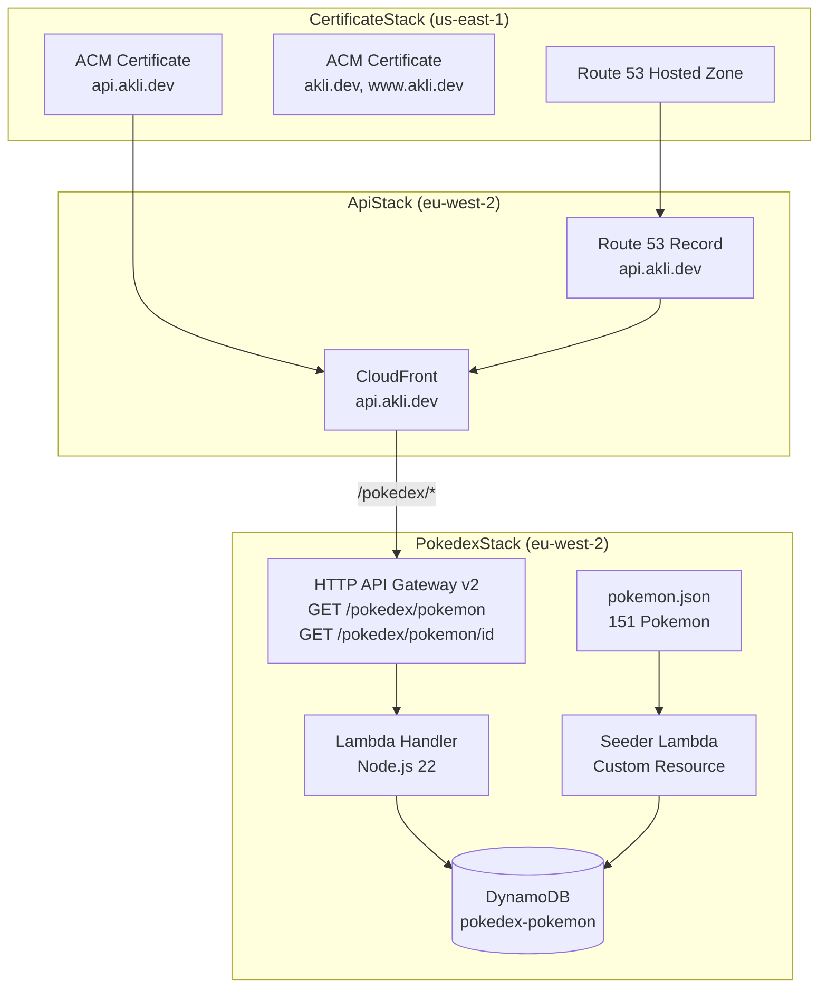

<Image src="/images/blog/pokedex-desktop.webp" alt="Pokedex app showing the Pokemon list and detail panel" caption="The finished Pokedex, running on akli.dev" />

I built a full-stack Pokedex as a portfolio project. It runs on AWS, costs almost nothing to host, and looks like a Game Boy Color screen. The frontend is React 19 with TypeScript. The backend is API Gateway, Lambda, and DynamoDB, all defined in CDK.

You can try it at [akli.dev/apps/pokedex](https://akli.dev/apps/pokedex).

## Three CDK stacks

The infrastructure lives in a separate repo from the frontend. I split it into three stacks because each has different deployment constraints.

<FileTree title="akli-infrastructure" content={"bin/\n  akli-infrastructure.ts\nlib/\n  certificate-stack.ts\n  pokedex-stack.ts\n  api-stack.ts\nlambda/\n  pokedex-handler.ts\n  seed-pokemon.ts\ndata/\n  pokemon.json"} />



**CertificateStack** deploys to `us-east-1`. CloudFront requires certificates in that region, so this stack owns the Route 53 hosted zone and ACM certificates. The other stacks consume its outputs through CDK's cross-region references.

**PokedexStack** deploys to `eu-west-2`. It creates the DynamoDB table, the Lambda handler, and the HTTP API Gateway. It also seeds the database automatically on every deploy (more on that below).

**ApiStack** also in `eu-west-2`. It puts a CloudFront distribution in front of the API Gateway, with a custom domain at `api.akli.dev`. This stack exists so I can add future APIs as additional cache behaviours on the same distribution.

The stacks reference each other through props. The CDK app wires them together:

```typescript title="bin/akli-infrastructure.ts"
const pokedexStack = new PokedexStack(app, 'PokedexStack', {
  env: { account, region: 'eu-west-2' },
})

new ApiStack(app, 'ApiStack', {
  apiCertificate: certStack.apiCertificate,
  hostedZone: certStack.hostedZone,
  pokedexApiUrl: pokedexStack.httpApi.apiEndpoint,
})
```

CDK stack dependencies are just TypeScript props. No SSM parameter lookups, no hardcoded ARNs.

## One Lambda, two routes

The API uses HTTP API Gateway v2, which is cheaper and simpler for a read-only service like this.

A single Lambda function handles both routes. API Gateway v2 passes a `routeKey` string, so the handler just matches against it:

```typescript title="lambda/pokedex-handler.ts"
const ROUTE_LIST = 'GET /pokedex/pokemon'
const ROUTE_DETAIL = 'GET /pokedex/pokemon/{id}'

export const handler = async (
  event: APIGatewayProxyEventV2,
): Promise<APIGatewayProxyStructuredResultV2> => {
  const routeKey = event.routeKey

  if (routeKey === ROUTE_LIST) {
    const result = await client.send(new ScanCommand({
      TableName: TABLE_NAME,
      ProjectionExpression: 'id, #n, types, sprite',
      ExpressionAttributeNames: { '#n': 'name' },
    }))
    const items = (result.Items ?? []).map((item) => unmarshall(item))
    return jsonResponse(200, { pokemon: items })
  }

  if (routeKey === ROUTE_DETAIL) {
    const id = Number(event.pathParameters?.id)
    const result = await client.send(new GetItemCommand({
      TableName: TABLE_NAME,
      Key: { id: { N: String(id) } },
    }))
    return jsonResponse(200, unmarshall(result.Item))
  }
}
```

The list endpoint uses a `ProjectionExpression` to return only the fields the list view needs: id, name, types, and sprite URL. The detail endpoint returns the full item. This keeps the list payload small.

## Automated data seeding

The Pokedex data comes from a static JSON file checked into the infrastructure repo. I didn't want a manual "run this script after deploying" step, so I used a CDK Custom Resource to seed DynamoDB automatically.

The interesting part is change detection. CDK computes an MD5 hash of `pokemon.json` at synth time and passes it as a property on the Custom Resource:

```typescript title="lib/pokedex-stack.ts"
const pokemonDataHash = crypto
  .createHash('md5')
  .update(fs.readFileSync(pokemonDataPath, 'utf-8'))
  .digest('hex')

new CustomResource(this, 'SeedPokemonResource', {
  serviceToken: seedProvider.serviceToken,
  properties: {
    DataHash: pokemonDataHash,
  },
})
```

When the hash changes, CloudFormation treats it as a resource update and invokes the seeder Lambda. When the hash stays the same, nothing happens. The seeder uses `BatchWriteItem` with exponential backoff, splitting the data into batches of 25 (DynamoDB's limit per request).

<Callout type="tip">CDK Custom Resources are great for one-time setup tasks. The `properties` trick gives you free change detection.</Callout>

## Frontend caching with useRef

The frontend uses two hooks for data fetching. `usePokemonList` fetches all summaries on mount. `usePokemonDetail` fetches a single Pokemon's full data when the user selects one.

The detail hook caches responses in a `useRef` so clicking a previously viewed Pokemon is instant:

```typescript title="src/hooks/usePokemonDetail.ts"
export const usePokemonDetail = (id: number | null) => {
  const [detail, setDetail] = useState<PokemonDetail | null>(null)
  const [loading, setLoading] = useState(false)
  const [error, setError] = useState<string | null>(null)
  const cache = useRef<Record<number, PokemonDetail>>({})

  useEffect(() => {
    if (id === null) return

    if (cache.current[id]) {
      setDetail(cache.current[id])
      return
    }

    let cancelled = false
    setLoading(true)

    const load = async () => {
      const data = await fetchPokemonDetail(id)
      if (!cancelled) {
        cache.current[id] = data
        setDetail(data)
        setLoading(false)
      }
    }

    load()
    return () => { cancelled = true }
  }, [id])

  return { detail, loading, error }
}
```

`useRef` survives re-renders without triggering them. The `cancelled` flag prevents state updates on unmounted components.

## The Game Boy Color look

I wanted the app to feel like a handheld console, not a typical web app. A few CSS decisions carry most of the weight.

The pixel font is **Press Start 2P**, loaded as a local woff2 file. Every label, stat name, and Pokemon name uses it. The body text falls back to `Courier New` for readability.

Pokemon sprites use `image-rendering: pixelated` so they stay crisp at any size instead of getting blurry from bilinear filtering.

Each Pokemon type gets its own colour token. I precomputed the text colours to meet WCAG AA contrast ratios against their backgrounds.

Stat bars animate in with a staggered delay. Each bar receives its index as a CSS custom property, and the animation delay is computed from it:

```css title="src/components/StatBar/StatBar.module.css"
.fill {
  width: var(--stat-width);
  animation: fillBar 300ms ease-out forwards;
  animation-delay: calc(var(--stat-index, 0) * 75ms);
}
```

The result: HP fills first, then Attack, then Defense, cascading down the list. The animation also respects `prefers-reduced-motion`.

<Image src="/images/blog/pokedex-mobile.webp" alt="Pokedex mobile view showing the detail overlay with stat bars" caption="The mobile detail overlay with animated stat bars" maxWidth="400px" />

## What I'd do differently

**Pagination.** The list endpoint does a full table scan. With 151 Pokemon that's fine. With 1000+ it wouldn't be. I'd add cursor-based pagination with DynamoDB's `LastEvaluatedKey`.

**Shared types.** The frontend and infrastructure repos define the same `Pokemon` interface independently. A shared package or a generated OpenAPI spec would keep them in sync.

**End-to-end CDK tests.** I unit-tested the Lambda handlers and the stack synthesis, but I didn't test the Custom Resource seeder against a real DynamoDB table. A CDK integration test using `integ-runner` would catch issues that unit tests miss.

You can try the Pokedex at [akli.dev/apps/pokedex](https://akli.dev/apps/pokedex).
