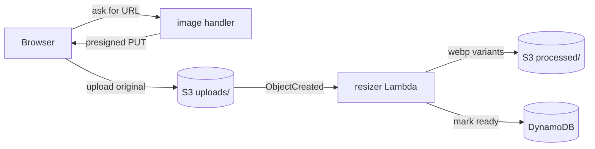

<Image src="/images/blog/recipes.webp" alt="The recipes section of akli.dev showing a grid of recipe cards" caption="The recipes section, running on akli.dev" priority />

I added a recipes section to akli.dev. The public side is a grid you can browse and search at [akli.dev/recipes](https://akli.dev/recipes). Behind a login there's an editor I use to write the recipes, which makes the whole thing closer to a small content management system than a static page.

I could describe it as a stack: React on the front, Lambda and DynamoDB and S3 on the back, Cognito for auth, all wired up in the CDK. The more interesting way to understand it is to follow one recipe through the system, from the instant I click "New" to the moment a user reads it on their phone.

## A recipe exists before I've typed a word

When I click "New" in the admin, the app doesn't wait for me to fill anything in. It immediately creates a draft on the server and redirects me to its editor.

That decision shaped a lot of what follows. Image uploads need a recipe to attach to, so the recipe has to exist before I add a photo. Creating it up front means the rest of the editor never has to special-case "this recipe isn't saved yet".

The create call is admin-only. The app sends a Cognito JWT, and the Lambda reads the group claim off it to decide whether the caller is allowed in. API Gateway has already checked the signature, so the handler only has to look at the contents:

```typescript title="lambda/recipe-handler.ts"
function isAdmin(event: APIGatewayProxyEventV2): boolean {
  const payload = decodeJwt(event)
  const groups = payload?.['cognito:groups']
  return Array.isArray(groups) && groups.includes('admin')
}
```

The new recipe lands in DynamoDB as a single item keyed by a UUID, with `status: 'draft'` and one attribute I'm fond of: a `ttl` set about thirty days out. DynamoDB treats that as an expiry. If I start a recipe and never come back, the database deletes it for me. There's no cleanup job and no cron. Abandoned drafts evaporate on their own, and publishing later removes the `ttl` so a real recipe sticks around forever.

## Everything I type saves itself

The editor has no save button. It autosaves a couple of seconds after I stop typing, which I built as a small hook. It waits for a quiet moment, checks whether anything actually changed since the last save, and skips the request if nothing did:

```typescript title="src/hooks/useAutosave.ts"
useEffect(() => {
  if (!state.dirty) return
  if (isEqualSnapshot(lastSavedSnapshotRef.current, state)) return
  clearTimer()
  timerRef.current = setTimeout(() => runSave(stateRef.current), intervalMs)
}, [state, intervalMs])
```

It also flushes immediately if I close the tab, so a half-finished sentence isn't lost. The form's state lives in a reducer, which keeps the autosave, the field edits, and the image updates from stepping on each other. Each save is a `PATCH` that updates only the fields that moved.

## Adding a photo is three hops, not one

Uploading the cover image looks instant to me, but the server does it in three steps. The browser asks the API for a short-lived upload URL. It uploads the file straight to S3 with that URL. S3 then fires an event that wakes up a second Lambda, which does the actual image work.



The resizer turns one upload into three WebP sizes with sharp, so the public pages can serve a small thumbnail in the grid and a larger one on the detail page:

```typescript title="lambda/image-resizer.ts"
const VARIANT_SIZING = {
  thumb:  { width: 400,  quality: 80 },
  medium: { width: 800,  quality: 85 },
  full:   { width: 1200, quality: 90 },
}
```

Each image is stored under the recipe's slug, so the cover ends up at `recipes/beans-on-toast/cover-medium.webp`. The slug is the human-readable name in the URL, and using it for the files too means the frontend can work out an image's address from the slug alone. The API never has to hand back raw S3 keys.

## The photo isn't ready the moment it finishes uploading

Here's the part that surprised me first time round. The upload completing and the image being viewable are two different events. Between them, the resizer is still running, and the URL I'd render returns a 404.

So the resizer leaves a note when it's done. After it writes the variants, it stamps a timestamp onto the recipe in DynamoDB:

```typescript title="lambda/image-resizer.ts"
await docClient.send(new UpdateCommand({
  TableName: tableName,
  Key: { id: recipeId },
  UpdateExpression: 'SET imageStatus.#k = :ts',
  ExpressionAttributeNames: { '#k': processedKey },
  ExpressionAttributeValues: { ':ts': Date.now() },
}))
```

The API turns that note into a `processedAt` field on the image. The editor reads it as "safe to show now". Until it appears, the editor shows a skeleton placeholder and quietly polls the recipe every second and a half, swapping the placeholder for the real photo the moment it's ready.

<Image src="/images/blog/recipe-editor.webp" alt="The admin recipe editor with a recipe open for editing" caption="The admin editor I use to write recipes" maxWidth="600px" />

The same `processedAt` check guards publishing, so I can't accidentally ship a recipe whose hero image is still a 404.

<Callout type="warning">Ordering matters in this pipeline. An early version deleted the original upload before it had recorded the result, and a retry couldn't get the file back. The fix was to delete the source last, only once the result is safely written.</Callout>

## The name in the URL is editable, then it isn't

The slug is the readable bit of the address, `akli.dev/recipes/beans-on-toast`. I want to be able to set it, and it has to be unique. Uniqueness is a secondary index on the table, so a clash is a fast lookup rather than a full scan, and a duplicate name returns a clear conflict instead of silently becoming `beans-on-toast-2`.

The catch is that the slug also names every image file. Once a photo exists at `recipes/beans-on-toast/...`, renaming the recipe would break every one of those URLs. So the slug is editable right up until the first upload, and after that it locks. The editor auto-fills it from the title while the recipe is fresh, then disables the field once an image is in flight. The server enforces the same rule as a backstop and rejects a late change with a conflict.

## Publishing is a switch with a checklist

When I hit publish, the server runs a validation pass before flipping anything. It checks the recipe has a title, an intro, at least one ingredient, at least one step with text, and that every image has finished processing. Only then does it change the status and drop the expiry that marked it as a draft:

```typescript title="lambda/recipe-handler.ts"
// publishing makes the recipe permanent
UpdateExpression: 'SET #status = :published, updatedAt = :now REMOVE #ttl'
```

Publishing is admin-only too. A contributor can write and edit their own drafts, but putting something on the public site requires admin privileges. Unpublishing runs the same machinery in reverse and puts the expiry back.

## Now anyone can read it

The moment the status flips, the recipe shows up in the public list. That page pulls every published recipe once, then handles the search box and tag filters on the client, since there aren't enough recipes yet to justify doing it on the server.

The detail page is rendered on the server so it has proper titles and link previews when it's shared. To avoid the page fetching data the server already had, the server passes the recipe down through a context, and the page uses it directly instead of asking the API again:

```typescript title="src/pages/RecipeDetail/RecipeDetail.tsx"
const { recipe: ssrRecipe } = useContext(RecipeDataContext)
const [recipe, setRecipe] = useState<Recipe | undefined>(ssrRecipe)
const [loading, setLoading] = useState(!ssrRecipe)
```

From there it's straightforward: ingredients in a list, steps in order, each step's photo loaded from that same slug-based URL. The visitor never sees the draft, the autosave, the three-hop upload, or the thirty-day timer. They just see a recipe.

## Where it's still rough

Renaming a recipe after I've added a photo means deleting the photo first, because of that slug lock. A proper rename would copy the image files to the new name and update the references in one server step. It's the gap that annoys me most.

The other one is testing. I unit-tested the Lambdas with S3 and DynamoDB mocked separately, and that's exactly why the image-pipeline ordering bug slipped through. A test that runs against a real local S3 and DynamoDB, and kills the write halfway, would have caught it before I did.

For all that, it does the thing I wanted. I write a recipe in a plain editor, add a photo, press publish, and it's live. You can read the results at [akli.dev/recipes](https://akli.dev/recipes).
